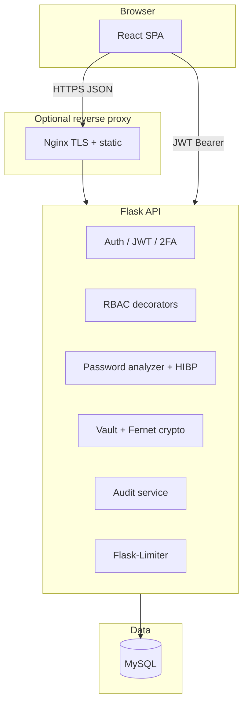

# Professional Assessment Documentation

**Password Strength Checker & Manager** — consolidated assessment for coursework, security review, or handover. This document integrates architecture, security concepts, threat modeling, controls, DevSecOps, testing, operations, and roadmap. Detailed API tables remain in [`API.md`](API.md); Docker and CI specifics in [`DOCKER.md`](DOCKER.md) and [`CI_CD_PIPELINE.md`](CI_CD_PIPELINE.md).

---

## 1. Project Overview

### 1.1 Purpose

A full-stack **password intelligence** and **credential management** application demonstrating modern web security practices: password analysis (entropy, complexity, patterns, breach awareness), **encrypted vault** storage, **JWT authentication** with **RBAC**, **TOTP two-factor authentication**, **rate limiting**, **audit logging**, and a **React** single-page application with **Vite** and **Tailwind CSS**.

### 1.2 Technology Stack

| Layer | Technologies |
|-------|----------------|
| API | Python 3.12, Flask 3, SQLAlchemy, Flask-JWT-Extended, Flask-Migrate (Alembic), Gunicorn |
| Data | MySQL 8 (production path), SQLite (local/dev/CI convenience) |
| Client | React 19, TypeScript, Vite, Tailwind v4, Framer Motion, Axios |
| Crypto / auth | `cryptography` (Fernet, HKDF), bcrypt / Argon2id (via Flask-Bcrypt and argon2-cffi), PyOTP |

### 1.3 Scope Boundaries

- **Teaching / demonstration**: Heuristic password scoring and crack-time models are **not** cryptographic proofs of guessing difficulty; they support informed decisions alongside dictionary and breach signals.
- **Vault model**: Server-side encryption with a **pepper** and user id is **not** zero-knowledge; assessors and operators must read the threat model (Section 4).

---

## 2. System Architecture

### 2.1 Logical Architecture

### 2.2 Request Path (typical)

1. **SPA** calls versioned JSON under **`/api/v1`** (see `API_PREFIX`).
2. **CORS** allows only configured origins (`CORS_ORIGINS`); credentials are not cookie-based for the API, reducing classic **CSRF** surface against cookie sessions (Section 5.10).
3. **JWT** in `Authorization: Bearer` is verified; **2FA pending** tokens are rejected from privileged routes (`jwt_full`, `role_required` in `app/security/rbac.py`).
4. **SQLAlchemy** ORM uses bound parameters for all persistence (Section 5.8).
5. **Vault** routes always filter by authenticated `user_id` to prevent **IDOR**.

### 2.3 Key Modules (backend)

| Module | Responsibility |
|--------|------------------|
| `app/routes/auth.py` | Register, login, refresh, logout, 2FA setup/verify/disable; rate limits |
| `app/routes/password.py` | Analyze, generate, HIBP, local breach, hash demos, crack estimate |
| `app/routes/vault.py` | CRUD + search + reveal password + strength check on stored items |
| `app/routes/admin.py` | Admin-only analytics and user listing |
| `app/routes/audit.py` | User-visible audit subset |
| `app/services/password_analyzer.py` | Entropy, complexity, patterns, common-password detection |
| `app/services/hibp.py` | k-anonymity range client |
| `app/services/credential_crypto.py` | HKDF + Fernet per-user field encryption |
| `app/services/hashing.py` | bcrypt / Argon2id demo and education payloads |

---

## 3. Password Security Concepts

This section explains how the implemented **analyzer** and related endpoints model password risk. Implementation reference: `app/services/password_analyzer.py`, `app/services/crack_time.py`, `app/services/breach_check.py`.

### 3.1 Entropy Calculation

**Goal:** Estimate an upper bound on naive search space from the password string, adjusted for obvious structure.

The engine combines:

1. **Class-model upper bound** — \(L \cdot \log_2(C)\) where \(L\) is length and \(C\) is the **charset size** implied by observed character classes (lowercase, uppercase, digits, symbols summed as independent pools per `_charset_size`).
2. **Empirical Shannon bound** — treats the password as i.i.d. over the **empirical character distribution** (`_empirical_iid_bits`), which collapses repeated characters (e.g. `aaaa`) toward low bits.

The implementation takes the **minimum** of these two (conservative) and applies a **soft penalty** proportional to distinct **pattern** classes (Section 3.4), capped so the result stays non-negative. Output: **`entropy_bits`** (float, rounded).

**Interpretation:** This is a **heuristic teaching model**, not a guarantee against dictionary, rules, masks, or leaked corpora.

### 3.2 Complexity Scoring

**Goal:** A separate **0–100** policy-style score (`complexity_score`) distinct from entropy.

Signals include length, per-class bonuses, uniqueness ratio, pool-size bonuses, and **penalties** per detected pattern (keyboard walks, sequential digits/letters, repeated characters, predictable words, leetspeak, dates, etc.). **Common passwords** (`is_common`) incur a large penalty.

**Strength label** (`very_weak` … `very_strong`) is derived from the score, common-password flag, and pattern set (`_strength_label`).

### 3.3 Dictionary Attack Simulation (Teaching Layer)

Two complementary layers address **dictionary / corpus** risk without claiming a full offline attack simulation:

1. **Dictionary / common list** — offline corpus (`_TOP_COMMON` + `common_passwords.txt`) and substring heuristics set **`is_common`** and influence suggestions.
2. **Crack-time estimate** (`estimate_crack_seconds` in `crack_time.py`) — models a **brute-force-style upper bound**: \(2^{\text{entropy\_bits}}\) divided by a configurable **guesses-per-second** (default ~10⁹, “GPU cluster” order of magnitude), with a safety margin. Output includes a human-readable horizon.

Together they communicate: **high entropy does not defeat dictionaries**, and **dictionaries defeat naive entropy math** — the UI and API expose both dimensions.

### 3.4 Pattern Detection

`_detect_patterns` applies deterministic heuristics: keyboard adjacency, digit/letter runs, repeated characters, year/date tokens, leetspeak substitutions, name-like templates, etc. Matched keys drive penalties, labels, and user-facing **suggestions** (`_build_suggestions`).

### 3.5 HIBP k-Anonymity

Per **Pwned Passwords** design:

1. SHA-1 hash the password **locally** (`hashlib.sha1(..., usedforsecurity=False)` — appropriate for this **public corpus contract**, not for credential storage).
2. Send only the **first 5 hex characters** of the digest in the URL path to `api.pwnedpasswords.com`.
3. Receive the bucket of **35-hex suffixes + counts**; match the full suffix **locally**.

The server never receives the full hash in the request body; **k-anonymity** limits linkability. See [`HIBP_BREACH_CHECKING.md`](HIBP_BREACH_CHECKING.md).

### 3.6 Password Hashing with bcrypt

User passwords at rest use **bcrypt** (default) via Flask-Bcrypt: slow hashing, per-password salt, adaptive cost. The **hash demo** endpoint (`hashing.py`) exposes cost parameters and timing for education.

### 3.7 Password Hashing with Argon2id

The codebase supports **Argon2id** as `PASSWORD_HASH_DEFAULT=argon2id` and demonstrates Argon2id in the hash demo (memory/time parameters surfaced in metadata). Argon2id is memory-hard and recommended for new systems where the stack supports it; bcrypt remains widely deployed and acceptable when correctly configured.

### 3.8 Secure Credential Encryption

Vault username/password/notes fields use **Fernet** (AES-CBC + HMAC in the Fernet construction) with keys derived per user via **HKDF-SHA256** from `VAULT_KDF_PEPPER` and a stable user-specific salt string (`credential_crypto.py`). Ciphertexts are not portable across users without the pepper.

**Residual risk:** Anyone with **database + pepper** can decrypt — documented as a demo trade-off (Section 4).

---

## 4. Threat Model

### 4.1 Assets

- **User accounts** (credentials, roles, 2FA secrets).
- **JWT access/refresh tokens** (Bearer header transport).
- **Vault plaintext** (briefly in memory; ciphertext at rest).
- **Password analysis payloads** (ephemeral in request; metadata persisted for history, not plaintext passwords).
- **Audit and admin analytics** (metadata only; sanitized).

### 4.2 Adversaries

- **Network attacker** (MITM if TLS absent — production must use TLS).
- **Authenticated malicious user** (IDOR, abuse of APIs, rate-limit evasion).
- **Unauthenticated attacker** (credential stuffing, enumeration, injection).
- **Insider / DBA** with DB + config (can decrypt vault rows given current design).

### 4.3 Trust Boundaries

- Browser ↔ reverse proxy: must be **TLS** in production.
- API ↔ MySQL: TLS optional in Compose; required for real deployments handling sensitive data over the network.
- **Pepper** and **JWT secrets** live in deployment secrets managers, not in git.

### 4.4 Out of Scope (explicit)

- Client-side master password / true zero-knowledge vault.
- Hardware security modules (HSM).
- Full Web Application Firewall (WAF) or bot management at the edge.

---

## 5. Security Controls

### 5.1 RBAC (Role-Based Access Control)

- Roles: **`ADMIN`**, **`USER`** (enum in models).
- **`@role_required("ADMIN")`** wraps admin-only routes; **`@role_required("USER", "ADMIN")`** protects user-facing features (vault, password tools, audit self-service).
- **Current `User.role` from the database** is enforced — JWT `role` alone is not sufficient for privilege decisions (`rbac.py`), mitigating stale-claim issues after demotion.

### 5.2 Two-Factor Authentication (2FA)

- **TOTP** enrollment returns secret + QR; enable requires a valid code.
- After password login, **2FA-enabled** users receive **`twofa_pending`** in JWT claims until `/auth/two_factor/verify` succeeds.
- **`jwt_full`** and **`role_required`** reject `twofa_pending` for vault and similar routes.

### 5.3 SQL Injection Prevention

All queries use **SQLAlchemy** ORM or Core with **bound parameters**. Vault search builds `ilike` patterns as **bound values**, not concatenated SQL (`vault.py`). No raw string SQL composed from user input.

### 5.4 XSS Prevention

- API returns **JSON**; React renders text by default (avoid `dangerouslySetInnerHTML` for untrusted content).
- **`normalize_optional_text`** / **`strip_control_characters`** strip control characters from optional fields; **`escape_for_log_fragment`** escapes HTML-like content for safe log fragments (`sanitize.py`).
- **nginx** (Docker) sets `X-Content-Type-Options: nosniff` and related headers on static responses.

### 5.5 CSRF Protection

The API uses **Bearer JWT** in headers for authenticated calls, not browser **cookie sessions** for the API. That design avoids classic **cross-site request forgery** against same-site cookie auth for these endpoints. **CORS** is an explicit allow-list; wildcards with credentials are not used (`__init__.py`).

*Note:* If you later add cookie-based sessions to the same origin, introduce CSRF tokens or SameSite strict cookies.

### 5.6 Rate Limiting

**Flask-Limiter** decorates sensitive routes (auth, analyze, generate, admin export, etc.). Storage defaults to **`memory://`**; production with **multiple Gunicorn workers** should use **Redis** (`RATELIMIT_STORAGE_URI`) so limits are global.

### 5.7 Audit Logging

**`audit_service.write_audit`** records actions (login, vault access, admin queries, etc.) with **sanitized metadata** — passwords, decrypted vault secrets, and similar keys are redacted or truncated (`audit_sanitize.py`). CSV export is capped and filtered for admins.

### 5.8 HTTP Security Headers

`after_request` sets `X-Content-Type-Options`, `X-Frame-Options`, `Referrer-Policy`, `Permissions-Policy`, and cache-disable headers for API responses (`__init__.py`). **CSP** and **HSTS** are deployment concerns for the HTML host / reverse proxy (see findings).

### 5.9 IDOR Prevention

Vault handlers resolve resources with **`StoredCredential.user_id == current_user_id`** (`_get_owned`). Reveal/update/delete and search never expose another user’s rows.

### 5.10 Input Validation

Central validators in `app/utils/validation.py` (username, email, password policy, password check payloads) and length limits reduce DoS and malformed payload risk.

---

## 6. DevSecOps Pipeline

**Build → Security scan → Test → (DAST) → Quality → Deploy simulation.**

The GitHub Actions workflow **`.github/workflows/ci-cd.yml`** implements:

| Stage | Activities |
|-------|------------|
| **Build** | Install Python and Node dependencies; `compileall` backend; `npm ci` + production frontend build; artifacts (`frontend-dist`, metadata). |
| **Security** | **Bandit** (SARIF, policy fail), **Trivy** (filesystem + **backend Docker image**), **pip-audit** (dependency JSON/text). |
| **Test** | **pytest** + coverage + JUnit; **Vitest** + coverage (LCOV). Security regression via **`@pytest.mark.security`**. |
| **DAST** | Start API (SQLite CI), **OWASP ZAP** baseline, report artifacts. |
| **Quality** | **SonarCloud** (optional until `SONAR_TOKEN` + `sonar-project.properties` configured). |
| **Deploy simulation** | Download build artifacts; scripted “would deploy” checklist. |

Full job graph, artifacts, and secrets: [`CI_CD_PIPELINE.md`](CI_CD_PIPELINE.md).

---

## 7. Security Testing Tools

| Tool | Role in this project |
|------|------------------------|
| **Bandit** | Python SAST; finds insecure APIs, weak crypto misuse patterns. |
| **pip-audit** | Known-vulnerability scan on pinned requirements. |
| **Trivy** | Filesystem and container image CVE / misconfiguration scanning. |
| **OWASP ZAP** | Baseline DAST against running API (CI). |
| **pytest + markers** | Functional and security regression (`@pytest.mark.security`). |
| **Vitest + Testing Library** | SPA unit/integration tests. |
| **SonarCloud / SonarQube** | Maintainability, coverage integration, additional rulesets when enabled. |

---

## 8. Security Testing Findings

Summary of **expected** or **accepted** findings; detail in [`SECURITY_FINDINGS.md`](SECURITY_FINDINGS.md).

| Area | Finding / note |
|------|----------------|
| **Bandit B324** | SHA-1 for HIBP / breach file formats — mitigated with `usedforsecurity=False` and documentation. |
| **pip-audit** | Dependencies pinned; re-run after upgrades (`VULNERABILITY_REMEDIATION.md`). |
| **Trivy** | CI may use `exit-code: 0` for education; tighten for release gates. |
| **ZAP** | CSP/HSTS absent on plain HTTP JSON API in CI — expected; production terminates TLS and sets strict headers on HTML. |
| **Sonar** | Placeholder project keys until configured. |
| **Vault** | Server-derivable keys — explicit residual risk for grading. |

---

## 9. Vulnerability Remediation Evidence

Cross-reference: [`VULNERABILITY_REMEDIATION.md`](VULNERABILITY_REMEDIATION.md).

| Theme | Evidence |
|-------|-----------|
| Supply chain | Pinned versions; `pip-audit` clean at documented checkpoints. |
| Weak hash heuristic | SHA-1 scoped to HIBP contract + comments. |
| Missing security headers | `after_request` baseline headers + `test_security_headers.py`. |
| CORS | Allow-list only for `/api/v1/*`. |
| 2FA bypass | `jwt_full` + `role_required` + `test_two_factor_gate`. |

---

## 10. Testing Strategy

### 10.1 Backend (pytest)

- **Unit**: Password analyzer, HIBP client parsing, generator, crypto helpers.
- **Integration / HTTP**: Auth, RBAC, vault IDOR, admin APIs, rate limits, security payloads (SQL-like search strings, sanitization), audit CSV bounds.
- **Security suite**: `@pytest.mark.security` for authn/z and headers.
- **Coverage**: `pytest.ini` enables `--cov=app` with XML for Sonar.

### 10.2 Frontend (Vitest)

- Login render, protected routes, analyzer/generator/vault/admin surfaces with mocked `api` / auth where appropriate.
- Coverage via `@vitest/coverage-v8`.

### 10.3 CI Gates

Fail on Bandit findings; collect Trivy/ZAP/Sonar artifacts; tests must pass before deploy simulation.

---

## 11. API Documentation

**Normative reference:** [`API.md`](API.md) — versioned **`/api/v1`**, authentication flows, password and vault endpoints, admin and audit routes, error shapes, and rate limits.

**Highlights:**

- **Health**: `/health`, `/health/ready` (DB probe).
- **Auth**: register, login (returns tokens or 2FA challenge), refresh, logout, 2FA setup/enable/disable/verify.
- **Password intelligence**: analyze, strength (alias), generate, HIBP, local breach, hash demo, crack estimate, history metadata.
- **Vault**: list, search, CRUD, reveal password, check strength (metadata persisted, not plaintext password).
- **Admin**: dashboard, analytics, users, audit logs (+ CSV export).

---

## 12. Deployment Guide

### 12.1 Docker (recommended stack)

**[`DOCKER.md`](DOCKER.md)** covers:

- Root **`.env.example`** → `.env` (no secrets in compose file).
- **MySQL 8.0**, **API** (Gunicorn, non-root, migrations on start), **nginx** (unprivileged, SPA + `/api` proxy).
- **Workbench** TCP connection to published MySQL port.
- **Migrations** (`flask db upgrade` automatic in entrypoint; manual `exec` documented).
- **Healthchecks** for DB, API, web.

### 12.2 CI/CD

**[`CI_CD_PIPELINE.md`](CI_CD_PIPELINE.md)** — pipeline stages, artifacts, Sonar coverage paths, ZAP job behavior.

### 12.3 Production Checklist

- TLS everywhere; **HSTS** + **strict CSP** on static host.
- **Redis** for rate limiter and (if implemented) JWT blocklist.
- Rotate **SECRET_KEY**, **JWT_SECRET_KEY**, **VAULT_KDF_PEPPER**, DB passwords.
- **`FLASK_ENV=production`** — enforces stricter config validation (`config.py`).
- Restrict **`CORS_ORIGINS`** to real SPA origins.

---

## 13. User Manual

### 13.1 Account lifecycle

1. **Register** — username, email, password (policy enforced).
2. **Login** — username or email + password; if 2FA enabled, complete **TOTP** on verify page with **pending** token.
3. **Logout** — revokes refresh / blocklists access as implemented.

### 13.2 Password intelligence workspace

- **Analyzer** — type a candidate password; view entropy, score, patterns, breach flags, suggestions (debounced API calls).
- **Generator** — random or passphrase modes; copy/save flows per UI.
- **HIBP / local breach** — dedicated tools tab per dashboard navigation.

### 13.3 Vault

- **Create** entries (title, username, password, notes, URL).
- **Search** by title, URL, or username substring.
- **Reveal password** — explicit action, auto-hide timer (shoulder-surfing mitigation in UI copy).
- **Check strength** — updates stored metadata without persisting plaintext password in history tables.

### 13.4 Admin (role `ADMIN`)

- Analytics dashboards, user list, **audit log** review and CSV export (sanitized).

---

## 14. Challenges and Solutions

| Challenge | Solution |
|-----------|----------|
| Teaching entropy vs real attacks | Dual metrics: entropy upper bound + dictionary/common + patterns + HIBP. |
| Storing vault secrets on server | HKDF + Fernet per user; explicit pepper threat model. |
| 2FA without breaking JWT clients | Short-lived `twofa_pending` claim; separate verify step; route guards. |
| RBAC drift from JWT | Load **current** `User.role` from DB on each privileged request. |
| CI DAST stability | SQLite + env bootstrap; ZAP baseline with artifact upload; relaxed job policy until tuned. |
| Sonar without tokens | `continue-on-error` until project configured. |
| Multi-worker rate limits | Document Redis backend for Limiter. |

---

## 15. Future Improvements

1. **Redis-backed** JWT denylist / refresh rotation metadata.
2. **User-held master password** or KMS-wrapped keys for vault (true separation from DBA).
3. **Stricter CI gates** — Trivy/ZAP fail on configurable severities once baseline noise is understood.
4. **OpenAPI** document generation from code or schema for client codegen.
5. **E2E tests** (Playwright) against Compose stack.
6. **Secrets manager** integration (Vault, AWS SM, GCP SM) instead of flat `.env` in production.
7. **Content Security Policy** on API only if needed; primary CSP on static host.
8. **Account lockout** and progressive backoff on failed logins (coordinate with audit).
9. **WebAuthn / FIDO2** as second factor option.
10. **Structured logging** (JSON) with trace IDs for distributed tracing.

---

## Document map

| Document | Use |
|----------|-----|
| **This file** | End-to-end professional assessment narrative |
| [`API.md`](API.md) | Endpoint reference |
| [`DOCKER.md`](DOCKER.md) | Container deployment |
| [`CI_CD_PIPELINE.md`](CI_CD_PIPELINE.md) | DevSecOps automation |
| [`SECURITY_FINDINGS.md`](SECURITY_FINDINGS.md) | Tooling findings detail |
| [`VULNERABILITY_REMEDIATION.md`](VULNERABILITY_REMEDIATION.md) | Remediation evidence |
| [`HIBP_BREACH_CHECKING.md`](HIBP_BREACH_CHECKING.md) | HIBP integration |

---

*End of Professional Assessment Documentation.*
